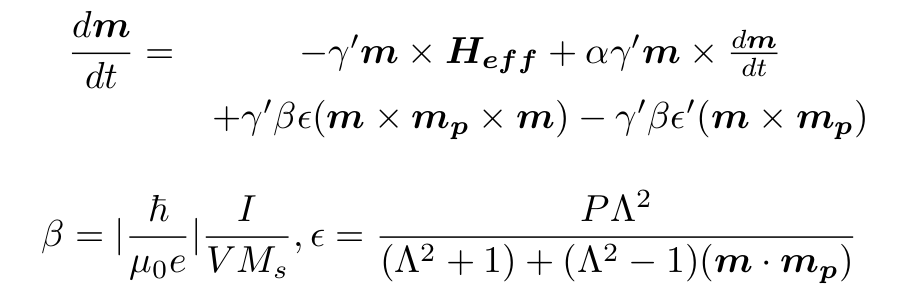
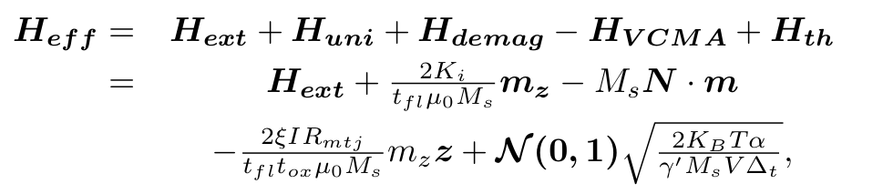
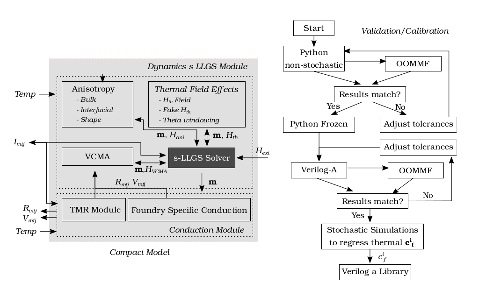
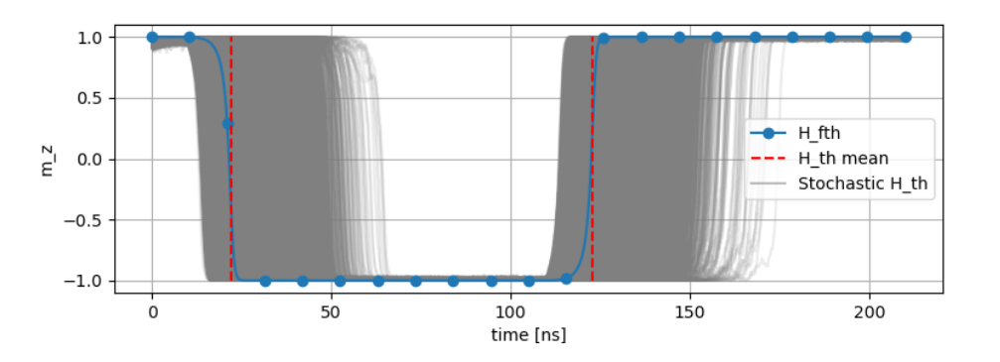
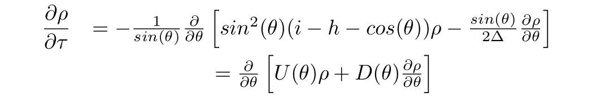
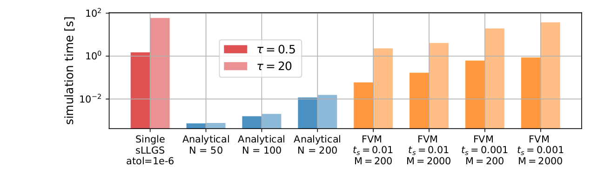
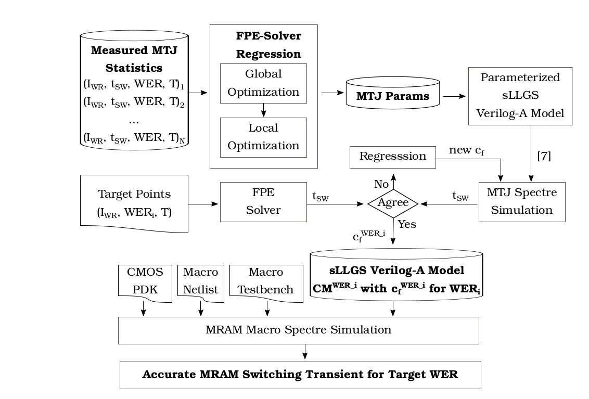
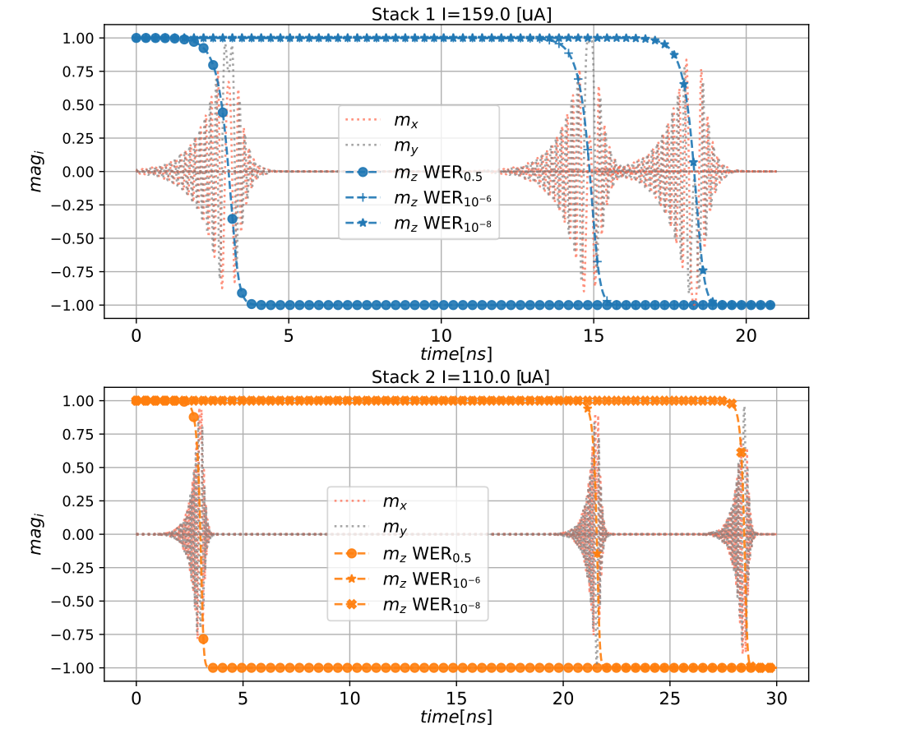

<!-- vim-markdown-toc GitLab -->

* [Authors and Related Publications](#authors-and-related-publications)
* [Motivation](#motivation)
	* [Introduction to MRAM technologies](#introduction-to-mram-technologies)
	* [MRAM stochasticity](#mram-stochasticity)
* [Arm's MRAM Simulation Framework](#arms-mram-simulation-framework)
	* ["A Compact Model for Scalable MTJ Simulation", or how to reliably and efficiently simulate circuits with MRAM, including stochasticity](#a-compact-model-for-scalable-mtj-simulation-or-how-to-reliably-and-efficiently-simulate-circuits-with-mram-including-stochasticity)
		* [Motivation for a new Verilog-a/Python Compact model](#motivation-for-a-new-verilog-apython-compact-model)
			* [Coordinate Systems and Implications](#coordinate-systems-and-implications)
			* [Integration Mechanism and Solver](#integration-mechanism-and-solver)
			* [Thermal Noise effects and Damping](#thermal-noise-effects-and-damping)
		* [Proposed Framework and Compact Model](#proposed-framework-and-compact-model)
		* [1-Mb MRAM Macro Benchmark and Conclusions](#1-mb-mram-macro-benchmark-and-conclusions)
	* ["A Fokker-Planck Solver to Model MTJ Stochasticity", or how to efficiently analyze stochasticity in MRAM.](#a-fokker-planck-solver-to-model-mtj-stochasticity-or-how-to-efficiently-analyze-stochasticity-in-mram)
		* [Fokker-Plank Equation](#fokker-plank-equation)
		* [Presented Solution Framework](#presented-solution-framework)
* [References](#references)

<!-- vim-markdown-toc -->

# Authors and Related Publications

* Fernando Garcia Redondo,
* Pranay Prabhat
* Mudit Bhargava

Thanks to Cyrille Dray and Milos Milosavljevic for his helpful discussions.

The following frameworks have been presented at
* ***A Compact Model for Scalable MTJ Simulation***, IEEE International Conference on Synthesis, Modeling, Analysis and Simulation Methods and Applications to Circuit Design, SMACD 2021.
* ***A Fokker-Planck Solver to Model MTJ Stochasticity*** European Solid-State Device Research Conference, ESSDERC 2021.

# Motivation 

## Introduction to MRAM technologies

Since it was discovered in 1975, Tunneling magnetoresistance (TMR) 
has been actively investigated.
Since 2000s, the advances in process technologies have made possible
the miniaturization of the Magnetic-Random-Access-Memories (MRAMs) based on TMR devices,
together with its integration into traditional CMOS processes.

**Figure 1. MRAM Structure**

As depicted in Figure 1, the basic MTJ structure is composed of two ferromagnetic materials insulated by a (traditionally) oxide layer.
The atom spins in each layer constitute the layer magnetization.
The pinned-layer's magnetization is fixed, but the free-layer's magnetization can be
altered.
The resistivity of the cell is determined by the magnetization direction of the two layers.
The resistance between the two terminals is minimum when both FL and PL magnetizations are parallel, (P State) and maximum when anti-parallel (AP State).

The discovery and later industrial manufacturing of Spin-Transfer-Torque (STT) MRAMs,
coming with enough endurance, retention, scalability and lower power consumptions,
postulated MRAM as the replacement of FLASH as the 
near future dominant Non-Volatile Memories (NVMs) technology.

In STT MRAMs the writing current flowing through the device produces a torque
momentum over the FL magnetization, flipping it should the current be large enough.
Figure 2 describes how the magnetization vector evolves through time, from 
a *z* ~ +1, to *z* ~ -1.

**Figure 2. MRAM Magnetization during switching**

Bottom graph describes the *x, y, z* components magnetization,
which we will use throughout this article.
The temporal evolution of the MTJ magnetization m as a monodomain 
nanomagnet, influenced by external and anisotropy
fields, thermal noise and STT, is described by the stochastic Landau-Lifshitz-Gilbert-
Slonczewsky (s-LLGS) equation [OOMMF].

**Figure 3. s-LLGS equations**

Where the effective field, Heff, is determined by the external field,
the anisotropy field (uniaxial and demagnetization), the voltage controlled anisotropy field,
and the thermal field.
The STT spin term is defined by the MRAM characteristics and the current applied between the two cell terminals.

## MRAM stochasticity

The random thermal noise induced field, Hth, converts the deterministic LLGS differential equation
into a stochastic differential system (s-LLGS).
Leaving process/voltage/temperature (PVT) variations out of the picture, this stochasticity
translates into uncertainty during operations.
The same cell, written at two different moments in time, behaves differently.
Consequently an MRAM cannot be considered a deterministic system, but a stochastic one.

In the next figure, we represent the *x, y, z* magnetization components
during two different write operations, occurring **on the same cell**.
Even though no PVT variations are present, we see how in two writing iterations (0 in blue, 1 in orange), 
the writing time (*z* flipping sign) varies considerably.

**Figure 4. Stochasticity causes two different write operations in the same cell to behave differently**

Translated to the circuit domain, the periphery surrounding the MRAM cell should be 
aware of this behavior, and designed accordingly to be able to reliably write/read
the MRAM cells incurring into low Write/Read Error Rates (WER and RER respectively).
**Therefore the circuit design relies then on the accurate modeling and simulation of 
the stochastic behavior of MRAM cells.**

Moreover, the simulation of **stochastic differential equation (SDE) systems require
the use of Ito or Stratonovich calculus** *[P. Horley, S. Ament]*.
Standard methods are not applicable,
and the simulation of SDEs becomes a problem that involves myriad of simulations
using of small time step, requiring huge computational resources.

In these document, related to the works presented at ***"A Compact Model for Scalable MTJ Simulation", SMACD 2021***,
and ***"A Fokker-Planck Solver to Model MTJ Stochasticity" ESSDERC 2021***, we
present the solutions to the following two problems:
* **how to reliably and efficiently simulate circuits with MRAM compact models, including stochasticity?**
* **how to efficiently analyze stochasticity?**

In the following sections we present the solutions we developed answering these questions.

# Arm's MRAM Simulation Framework

We present a framework for the characterization
and analysis of MRAM stochasticity, and a compact model and framework
for the efficient and scalable simulation of circuits with MRAMs.

We provide Verilog-A and Python compact models, able to emulate the behavior of
MRAMs switching at significant statistic events.
To calibrate the models for such stochastic based events, 
we implemented and analyzed two FPE solvers (numerical FVM and analytical), and
presented an optimization module that orchestrates the efficient computation 
of MRAM statistics and parameter regression.

## "A Compact Model for Scalable MTJ Simulation", or how to reliably and efficiently simulate circuits with MRAM, including stochasticity

### Motivation for a new Verilog-a/Python Compact model

Many MTJ models have been presented, from micro-magnetic approaches to macro-magnetic SPICE and
Verilog-A compact models for circuit simulations.
Compact models present in the literature account for
different behavioral aspects: a better temperature dependence,
a more accurate anisotropy formulation for particular MTJ
structures, or the integration of Spin-Orbit Torque
(SOT) for three-terminal devices, for example.

These prior works focus on the ability to model a specific new behavior for the
simulation of a single or a few MTJ devices in a small circuit.
A product-ready PDKs requires not only research contributions capturing novel device
behavior, but also optimization stages enabling
circuit design. 

#### Coordinate Systems and Implications
STT-MRAM circuit design needs the
complex device dynamics to be incorporated into the standard
SPICE-like solvers.
And doing it efficiently is not an easy task.
The s-LLGS system resolution can easily lead to artificial
oscillations if solved in a Cartesian reference system when
using the Euler, Gear and Trapezoidal methods provided by
circuit solvers.
In *[S. Ament]* it is studied how MTJ devices benefit
from resolution in spherical coordinates, specially when using
implicit midpoint and explicit RK45 methods. Additionally,
Cartesian methods require a non-physical normalization
stage for the magnetization vector *[S. Ament]*.

#### Integration Mechanism and Solver
Secondly, MTJ Verilog-A models present in the literature use a naive Euler/Trapezoidal
methods to integrate the magnetization vector

*m(t) = m(t − dt) + dmdt (2)*

However, Equation 1 causes *m_φ* to exceed the *[0, 2π)*
physically allowed range,
and grow indefinitely over time, leading
to unnatural voltages that eventually prevent simulator convergence.
Our solution is to use the circular integration idtmod
function provided by Spectre solvers, which wraps *m_φ* at
2π preventing it from increasing indefinitely.

More importantly, there is a hard trade-off when simulating *m_θ* on Equation (1)
between its accuracy, the integration method and the minimum timestep used.
Vector *m_θ* represents the binary state of the MTJ data
bit and is the most critical component to accurately model
MTJ switching. 

**Figure 5. Solver/time-step and accuracy trade-off.**

The naive integration of *m_θ* directly encoding
Equation 1 in the Verilog-A description incurs a substantial
error during a switching event, as shown in Figure 5.
Reducing the timestep improves the RMS error (against OOMMF reference) but at the cost of a large
increase in computational load. Our solution is to use the idt
function for the circuit solvers provided by Spectre,
which adapt the integration based on multiple evaluations of
the differential terms at different timesteps, leading to better
accuracy.

Regarding scalability, if a larger circuit is to be simulated and fixed timesteps
banned, it is essential to manage the tolerance/timestep scheme,
Otherwise during the computation of the *m_φ* component the asymptote 
*dmφ/dt → ∞* at *m_θ = 0*.
This precession mechanism acceleration, described by the next figure,
requires the solver to accordingly increase its resolution.
Thus, an appropriate tolerance scheme is to be used.

**Figure 6. Asymptote simulation requires smaller time steps to ensure convergence.**

#### Thermal Noise effects and Damping
*H_th* follows a Wiener process in which each *x, y, z*
random component is independent of each other and previous
states. 
This implies that the computation of *H_th* requires large
independent variations between steps, hindering the solver’s
attempts to guarantee signal continuity under small tolerances.
Under default solver tolerances aiming for circuit accuracy, the simulation 
leads to computational errors, and excessive computational
load under 1 ps bounded time steps, and require from user-defined Stratonovich
Heun/RK extra steps.

Three solutions have been proposed in the literature. First,
to emulate the random field by using an external current or
resistor-like noise source. However, SPICE simulators
impose a minimum capacitance on these nodes filtering the
randomness response, therefore preventing a true Wiener process
from being simulated, as they are later integrated using deterministic methods.
Second, to bound a fixed small
timestep to the solver, but as described before this is
not feasible for large circuits. Third, to only consider scenarios
where the field generated by the writing current is much
larger than *H_th* , forcing *H_th = 0*.

This has strong implications when moving from single to multiple successive
switching event simulations. Under no *H_th* thermal field,
the magnetization damping collapses *m_θ* to either *0* or *π*.
s-LLGS dynamics imply that the smaller the *m_θ* the harder
it is for the cell to switch, and if completely collapsed, it is
impossible.

**Figure 7. *m_z* collapses *m_θ=0* due to dampening under no thermal noise field presence,
Making impossible to simulate multiple-writes or long simulations**

The above picture depicts this artificial effect, which does
not have an equivalent in reality, as *H_th != 0* imposes a
random angle. Design, validation and signoff for large memory
blocks with integrated periphery and control circuits requires
the simulation of sequences of read and write operations, with
each operation showing identical predictable and switching
characteristics. However, the damping artifact discussed above
prevents or slows down subsequent switches after the first
event, since the subsequent events see an initial *θ* value
vanishingly close to zero.

### Proposed Framework and Compact Model

**Figure 8. Proposed compact model and Framework methodology.**

The above Figure describes the implemented compact model
and model analysis/calibration procedure and validation against OOMMF.
First, given a set of MRAM parameters, initial non-stochastic simulations 
are compared against OOMMF simulation results. The tolerances are adjusted
till the results match.
At this point, the model is frozen and exported to Verilog-A. 
The subsequent simulation validates the tolerances needed for the required accuracy.
Finally, the coefficients of the thermal noise emulation mechanism explained bellow
are regressed and the Verilog-A model library finalized.

The model is composed of two modules:
the Conduction and Dynamics modules.
The conduction scheme describing the instantaneous MTJ
resistance is dependent on the foundry engineered stack. Our
modular approach allows foundry-specific conduction mechanisms to complement
the basic Tunnel-Magneto-Resistance
(TMR) scheme. The Dynamics module describes
the temporal evolution of the MTJ magnetization *m*.

The compact model has been implemented in Python and Verilog-A.
Python model supports traditional
Ordinary Differential Equations (ODE) and SDE solvers, for the
simulation of *H_th* as a pure Wiener process [S. Ament, P. Horley].
The parallel Python engine enables MC and statistical studies. The
Verilog-A implementation uses idt /idtmod integration
schemes with parameterizable integration tolerances.
The following Figure describes our Verilog-A model once parameterized validated against OOMMF.

**Figure 9. Validation against OOMMF**

To enable the efficient simulation of the effects caused by the stochastic *H_th*
two solutions are proposed.
The purpose is to be able to simulate 
being simulate the mean switching behavior, and those switchings related
to given error rate *WER_i* behaviors. Thus, enabling the analysis of
how a given circuit instantiating that MRAM device would behave statistically
with negligible simulation performance degradation.

**Windowing Function Approach:** Our first objective is
to provide a mechanism for *m_θ* to saturate naturally to the
equilibrium value given by *H_th* during switching events. By
redefining the evolution of *m* on its *θ* component we are able
to saturate its angle at *θ_0* , the second moment of the Maxwell-
Boltzmann distribution of *m_θ* under no external field [OOMMF]

This function slows down the magnetization evolution
when reaching the angle *c_wi θ_0*, therefore saturating *m_θ*
and avoiding *m* from collapsing over *z*. Moreover, by using
*c_wi* we are able to define the angle that statistically follows
different stochastic behaviors corresponding to different write error rates. 

**Emulated Magnetic Term Approach**
The expansion of s-LLGS equation after its expression in spherical coordinates
describes *m_θ* evolution as proportional to *H_eff_φ + αH_eff_θ ~ H_eff_φ*.
We propose to add a fictitious term *H_fth_φ* with the purpose of
emulating the mean/*WER_i* *H_th* contribution that generates *θ_0* (*θ_0_i* for *WER_i*).

Thanks to the proposed approaches we can efficiently extract the mean/*WER_i* behaviors,
and generate the corresponding and calibrated Verilog-A models ready to be efficiently simulated.

**Figure 10. Stochastic SDE simulations requiring high computational resources and proposed *H_fth* simulation,
matching the mean stochastic behavior of the cell**

### 1-Mb MRAM Macro Benchmark and Conclusions
To validate scalability on a commercial product, the model
is instantiated into the 64 × 4 memory top block of the
extracted netlist from a 1-Mb 28 nm MRAM macro [E. M. Boujamma], and
simulated with macro-specific tolerance settings. The emulated
magnetic term enables the previously
impossible capability of simulating successive writes with
identical transition times due to non-desired over-damping.

The following Figure –resistance/voltage units omitted for confidentiality–
describes a writing operation 10 µs after power-on sequence.
We combine the s-LLGS OOMMF validated dynamics with
foundry-given thermal/voltage conductance dependence, providing
the accurate resistance response over time. Compared
to using fixed resistors, there is an overhead of 3.1× CPU time
and 1.5× RAM usage. In return, circuit designers can observe
accurate transient switching behaviour and read disturbs.

**Figure 11. Magnetization, BL, WL, SL and resistance of a cell writen within a 1Mb Macro**

## "A Fokker-Planck Solver to Model MTJ Stochasticity", or how to efficiently analyze stochasticity in MRAM.

As seen in Figure 10, the computation of  
WER/RER with s-LLGS simulations requires a large number
of random walks, especially for the low error rates (<< 1ppm)
required for volume production.

For example, the simulation of 10000 random walks solving the SDE using Stratonovich
Heun algorithm in Cartesian coordinates system (0.1ps time step) 
for the write error rate computation seen in Figure 12 took ~1150 hours. 
The characterization of a given MRAM cell for *WER=1e-8* 
would require a non-manageable amount of time and computational resources.

**Figure 12. WER simulation. 10000 SDE simulations using Stratonovich Heun method,
solved for cartesian coordinates system and 0.1ps time step took ~1150 hours.
Taking advantage of the presented python framework and multi-thread capabilities,
this computation time was reduced to ~18h (64 threads).
The Fokker-Plank WER computation is solved in seconds, providing the analytical solution.**

To alleviate this issue, Stochastic Differential Equation
(SDE) tools such as the Fokker–Planck Equation (FPE) statis-
tically analyze the MTJ magnetization and provide a simplified
solution with sufficient accuracy to analyze such error rates
[Tzoufras], [Y. Xie], [W. H. Butler].
Compared against a set of s-LLGS random-walk
transient simulations, the FPE accurately evolves an initial
MTJ magnetization probability through time based on the cur-
rent and external fields. Instead of independent transients, the
FPE computes the probability distribution of the magnetization
at a given instant, thus capturing the statistical behavior of the
MTJ cell. Figure 12 highlights how FPE is able to solve in seconds
what otherwise requires huge computational resources (myriads of s-LLGS simulations).

The problem magnifies when fitting to measured silicon data. Silicon measurement needs
low error rates to be captured accurately from finite memory
arrays without compromising test throughput in volume production,
requiring high currents to allow extrapolation from
higher, more easily measurable error rates. 
As a result, foundry
data could consist of a set of data points with the error rate
spanning orders of magnitude. 

Addressing both problems, 
the proposed stochastic framework
for the characterization and analysis of MRAM stochastic effects is described,
and the fitting of the complex set of MRAM parameters onto
such heterogeneous data points through a case study with
published foundry data. 

With the proposed solution, we are able to generate WER/RER in seconds,
enabling the search of the set of physical parameters 
that best fit a collection of ER points as a
function of a current pulse width and amplitude.

### Fokker-Plank Equation
The advection-diffusion or Fokker-Plank equation has been widely used to analyze
the evolution over time of the 
probability density function of the magnetization of an MRAM cell:

**Figure 13. Fokker-Plank equation**

Prior work numerically solves the FPE through finite differences
or finite volume methods (FVM) or analytical solutions.

**Figure 14. Computational load comparison of a single s-LLGS random walk and different FPE solvers**
In the above Figure we characterize the computational load required to simulate
a single s-LLGS stochastic random walk, different FVM FPE simulations using
different time and spatial resolutions, and various analytical FPE simulations
varying the number of coefficients of the expansion series used.
First, it can be clearly seen how computing millions of s-LLGS is simply unmanageable.
Second, while FVM FPE approaches are a good method for small amount of WER/RER computations,
should multiple simulations be required, like it is the case on the design space exploration
occurring during MRAM parameters fitting, the faster yet accurate analytical
solutions approach is required.

It is important to highlight that even FVM FPE solutions constituted a reasonable
solution enabling statistical analyses otherwise impossible using billions of s-LLGS,
the simulation time is directly proportional at the writing pulse width being simulated.
Therefore longer simulated times, required to characterize low-current regimes,
still involve huge computational resources.
On the contrary, the analytical FPE approach otherwise requires constant time to simulate
longer pulse widths.

The following Figure describes how the different resolutions and number of coefficients used
affect the accuracy of the computation of the magnetization probability evolution.

**Figure 15. Accuracy comparision for different resolution/number of coefficients.**

### Presented Solution Framework

Complementing the compact model and simulation framework that enable the
efficient simulation of circuits with MRAMs, the MRAM characterization 
framework focus on the MRAM behavior statistical analysis.

As described in the following Figure,
it enables the otherwise impossible MRAM parameter set regression from 
foundry WER curves.

**Figure 16. Proposed framework and methodology**

At the end of the process, the circuit designer obtains a set of MRAM compact models,
ready to be simulated in traditional circuit simulators, that have been 
accurately calibrated to represent the mean/*WER_i* cell behavior.

As a case of study, we take the two stack processes presented in [G. Hu], 
where a set of current/mean switching time points are provided.
First the most computing intensive tasks, regressing the MRAM parameters set
that best describe the provided stochastic behaviors takes place.
Our framework finds the proper parameters in reasonable time (*< 3 days*),
a task otherwise completely impossible using s-LLGS simulations,
and much slower (almost impractical) using FVM approaches.

**Figure 17. Current/switching time fitting for two MRAM stack processes without any prior knowledge**

At this point, as circuit designers we can easily compare the error rates
on both stacks, and determine the appropriate operating points, based on results
as the shown in the following Figure:

**Figure 18. WER/RER analyses for the regressed stacks**

With the physical parameters set found, we make use of the compact model presented at
["A Compact Model for Scalable MTJ Simulation"](#a-compact-model-for-scalable-mtj-simulation-or-how-to-reliably-and-efficiently-simulate-circuits-with-mram-including-stochasticity)
section, and compute the *H_fth_i* parameters that enable circuit designers 
to accurately simulate the required MRAM cell at the significant *WER_i* statistical events: 

# References

[P. Horley] Horley, P., et al. (2011).
Numerical Simulations of Nano-Scale Magnetization Dynamics.
Numerical Simulations of Physical and Engineering Processes. https://doi.org/10.5772/23745

[S. Ament] S. Ament et al., “Solving the stochastic Landau-Lifshitz-Gilbert-
Slonczewski equation for monodomain nanomagnets : A survey and
analysis of numerical techniques,” 2016.

[OOMMF] Donahue, M. J., & Porter, D. G. (1999).
OOMMF user’s guide, version 1.0. In National Institute of Standards and Technology. https://doi.org/10.6028/NIST.IR.6376

[E. M. Boujamaa] E. M. Boujamaa et al., “A 14.7Mb/mm2 28nm FDSOI STT-MRAM with
Current Starved Read Path, 52Ω/Sigma Offset Voltage Sense Amplifier
and Fully Trimmable CTAT Reference,” IEEE Symp. VLSI Circuits, Dig.
Tech. Pap., vol. 2020-June, 2020.

[Tzoufras] Tzoufras, M. (2018). Switching probability of all-perpendicular spin valve nanopillars. AIP Advances, 8(5). https://doi.org/10.1063/1.5003832

[Y.Xie] Xie, Y., et al. (2017). Fokker-Planck Study of Parameter Dependence on Write Error Slope in Spin-Torque Switching. IEEE Transactions on Electron Devices, 64(1), 319–324. https://doi.org/10.1109/TED.2016.2632438

[W. H. Butler] Butler, W. H., Mewes, T., Mewes, C. K. A., Visscher, P. B., Rippard, W. H., Russek, S. E., & Heindl, R. (2012). Switching distributions for perpendicular spin-torque devices within the macrospin approximation. IEEE Transactions on Magnetics, 48(12), 4684–4700. https://doi.org/10.1109/TMAG.2012.2209122

[G. Hu] Hu G. et al., “Spin-transfer torque MRAM with reliable 2 ns writing for
last level cache applications,” Tech. Dig. - Int. Electron Devices Meet.
IEDM, vol. 2019-Decem, pp. 2019–2022, 2019.
