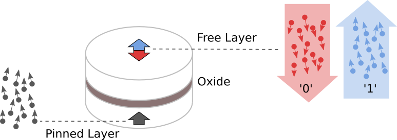
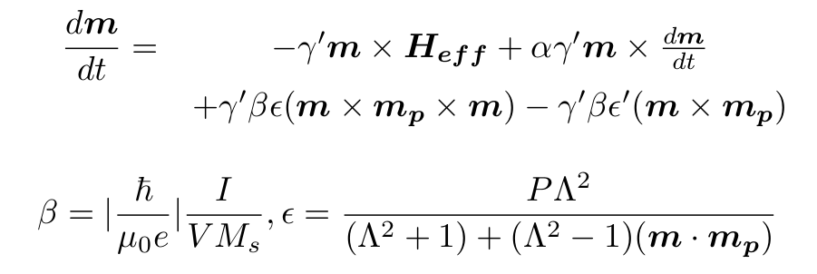
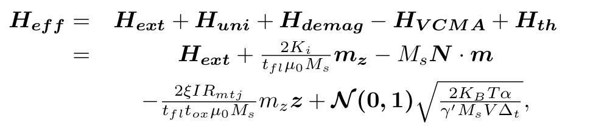
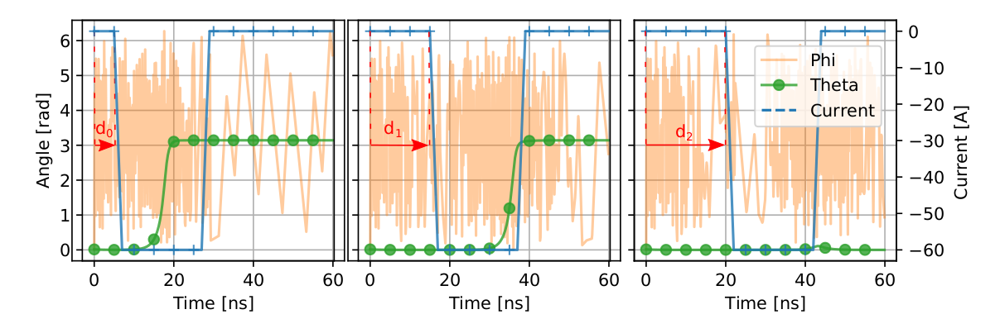
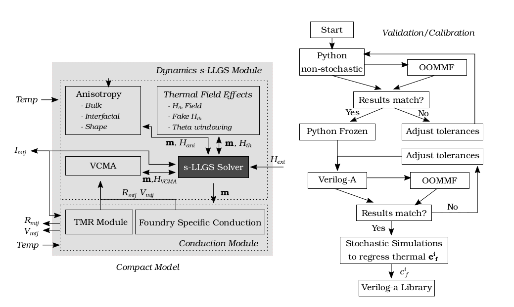
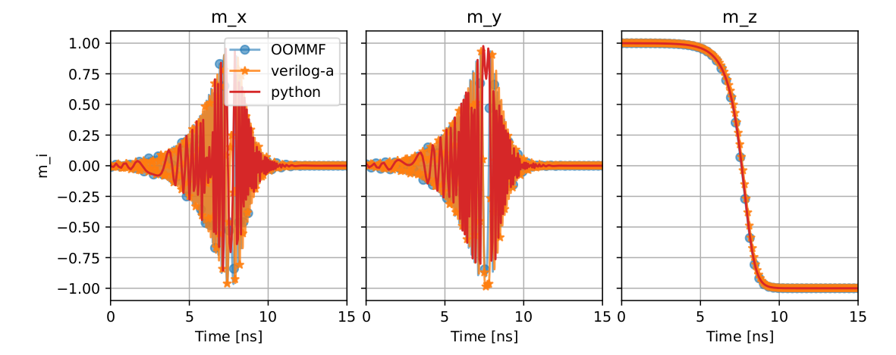
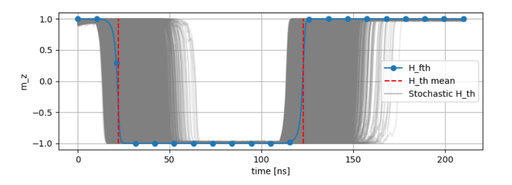
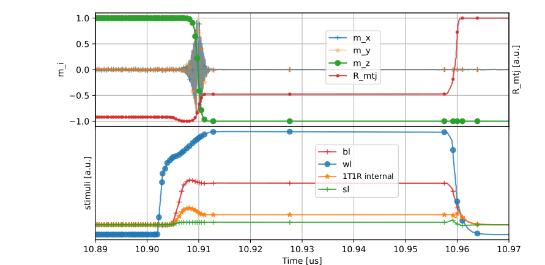

<!-- vim-markdown-toc GitLab -->

* [Motivation](#motivation)
	* [Introduction to MRAM technologies](#introduction-to-mram-technologies)
	* [MRAM stochasticity](#mram-stochasticity)
	* ["A Compact Model for Scalable MTJ Simulation", or how to reliably and efficiently simulate circuits with MRAM, including stochasticity](#a-compact-model-for-scalable-mtj-simulation-or-how-to-reliably-and-efficiently-simulate-circuits-with-mram-including-stochasticity)
		* [Motivation for a new Verilog-a/Python Compact model](#motivation-for-a-new-verilog-apython-compact-model)
		* [Proposed Framework and Compact Model](#proposed-framework-and-compact-model)
		* [1-Mb MRAM Macro Benchmark and Conclusions](#1-mb-mram-macro-benchmark-and-conclusions)
		* [But the MRAM story continues](#but-the-mram-story-continues)
* [References](#references)

<!-- vim-markdown-toc -->

* Fernando Garcia Redondo,
* Pranay Prabhat
* Mudit Bhargava

Thanks to Cyrille Dray and Milos Milosavljevic for his helpful discussions.

The following frameworks have been presented at
* ***A Compact Model for Scalable MTJ Simulation***, IEEE International Conference on Synthesis, Modeling, Analysis and Simulation Methods and Applications to Circuit Design, SMACD 2021.
* ***A Fokker-Planck Solver to Model MTJ Stochasticity*** European Solid-State Device Research Conference, ESSDERC 2021.

# Motivation 

## Introduction to MRAM technologies

Since it was discovered in 1975, Tunneling magnetoresistance (TMR) 
has been actively investigated.
Since 2000s, the advances in process technologies have made possible
the miniaturization of the Magnetic-Random-Access-Memories (MRAMs) based on TMR devices,
together with its integration into traditional CMOS processes.

**Figure 1. MRAM Structure**

As depicted in Figure 1, the basic MTJ structure is composed of two ferromagnetic materials insulated by a (traditionally) oxide layer.
The atom spins in each layer constitute the layer magnetization.
The pinned-layer's magnetization is fixed, but the free-layer's magnetization can be
altered.
The resistivity of the cell is determined by the magnetization direction of the two layers.
The resistance between the two terminals is minimum when both FL and PL magnetizations are parallel, (P State) and maximum when anti-parallel (AP State).

The discovery and later industrial manufacturing of Spin-Transfer-Torque (STT) MRAMs,
coming with enough endurance, retention, scalability and lower power consumptions,
postulated MRAM as the replacement of FLASH as the 
near future dominant Non-Volatile Memories (NVMs) technology.

In STT MRAMs the writing current flowing through the device produces a torque
momentum over the FL magnetization, flipping it should the current be large enough.
Figure 2 describes how the magnetization vector evolves through time, from 
a *z* ~ +1, to *z* ~ -1.

**Figure 2. MRAM Magnetization during switching**

Bottom graph describes the *x, y, z* components magnetization,
which we will use throughout this article.
The temporal evolution of the MTJ magnetization m as a monodomain 
nanomagnet, influenced by external and anisotropy
fields, thermal noise and STT, is described by the stochastic Landau-Lifshitz-Gilbert-
Slonczewsky (s-LLGS) equation [OOMMF].

**Figure 3. s-LLGS equations**

Where the effective field, Heff, is determined by the external field,
the anisotropy field (uniaxial and demagnetization), the voltage controlled anisotropy field,
and the thermal field.
The STT spin term is defined by the MRAM characteristics and the current applied between the two cell terminals.

## MRAM stochasticity

The random thermal noise induced field, Hth, converts the deterministic LLGS differential equation
into a stochastic differential system (s-LLGS).
Leaving process/voltage/temperature (PVT) variations out of the picture, this stochasticity
translates into uncertainty during operations.
The same cell, written at two different moments in time, behaves differently.
Consequently an MRAM cannot be considered a deterministic system, but a stochastic one.

In the next figure, we represent the *x, y, z* magnetization components
during two different write operations, occurring **on the same cell**.
Even though no PVT variations are present, we see how in two writing iterations (0 in blue, 1 in orange), 
the writing time (*z* flipping sign) varies considerably.

**Figure 4. Stochasticity causes two different write operations in the same cell to behave differently**

Translated to the circuit domain, the periphery surrounding the MRAM cell should be 
aware of this behavior, and designed accordingly to be able to reliably write/read
the MRAM cells incurring into low Write/Read Error Rates (WER and RER respectively).
**Therefore the circuit design relies then on the accurate modeling and simulation of 
the stochastic behavior of MRAM cells.**

Moreover, the simulation of **stochastic differential equation (SDE) systems require
the use of Ito or Stratonovich calculus** *[P. Horley, S. Ament]*.
Standard methods are not applicable,
and the simulation of SDEs becomes a problem that involves myriad of simulations
using of small time step, requiring huge computational resources.

In these blog posts related to the works presented at ***"A Compact Model for Scalable MTJ Simulation", SMACD 2021***,
and ***"A Fokker-Planck Solver to Model MTJ Stochasticity" ESSDERC 2021***, 
we present a framework for the characterization
and analysis of MRAM stochasticity, and a compact model and framework
for the efficient and scalable simulation of circuits with MRAMs.

We provide Verilog-A and Python compact models, able to emulate the behavior of
MRAMs switching at significant statistic events.
To calibrate the models for such stochastic based events, 
we implemented and analyzed two FPE solvers (numerical FVM and analytical), and
presented an optimization module that orchestrates the efficient computation 
of MRAM statistics and parameter regression.

Therefore, in this series of posts, we present the solutions and answers
to the following two problems:
* **how to reliably and efficiently simulate circuits with MRAM compact models, including stochasticity?**, blog post #1
* **how to efficiently analyze stochasticity?**, blog post #2

## "A Compact Model for Scalable MTJ Simulation", or how to reliably and efficiently simulate circuits with MRAM, including stochasticity

### Motivation for a new Verilog-a/Python Compact model

Many MTJ models have been presented, from micro-magnetic approaches to macro-magnetic SPICE and
Verilog-A compact models for circuit simulations.
Compact models present in the literature account for
different behavioral aspects: a better temperature dependence,
a more accurate anisotropy formulation for particular MTJ
structures, or the integration of Spin-Orbit Torque
(SOT) for three-terminal devices, for example.

These prior works focus on the ability to model a specific new behavior for the
simulation of a single or a few MTJ devices in a small circuit.
A product-ready PDKs requires not only research contributions capturing novel device
behavior, but also optimization stages enabling
circuit design. 

STT-MRAM circuit design needs the
complex device dynamics to be incorporated into the standard
SPICE-like solvers.
And doing it efficiently is not an easy task.
The s-LLGS system resolution, even when the stochasticity is not under consideration,
can easily lead to non-convergence and error issues.

Following the work initiated in *[S. Ament]* 
we analyze the integration methods and solver problems most commonly encountered
when solving s-LLGS systems, focusing on the SPICE-like circuit simulators approach.
We study the accuracy, time-step and solver characteristics trade-offs.
In particular, and focusing on the issues related to explicit integration methods,
we analyze the time-step dependence or the problematic of simulating
a Wiener process using Euler/Trapezoidal integrators.

Similarly important is the computational resources involved in simulating
*H_th* stochastic simulations using the appropriate Stratonovich stochastic differential
calculus.
This implies that the computation of *H_th* requires large
independent variations between steps, hindering the solver’s
attempts to guarantee signal continuity under small tolerances.
Under default solver tolerances aiming for circuit accuracy, the simulation 
leads to computational errors, and excessive computational
load under 1 ps bounded time steps, and require from user-defined Stratonovich
Heun/RK extra steps.

Solutions have been proposed in the literature. First,
to emulate the random field by using an external current or
resistor-like noise source. However, this noise sources
are not appropriate for simulating true Wiener processes,
as they are later integrated using deterministic methods.
The second solutions only consider scenarios
where the field generated by the writing current is much
larger than *H_th* , forcing *H_th = 0*.
This has strong implications when moving from single to multiple successive
switching event simulations. Under no *H_th* thermal field,
the magnetization damping collapses *m_θ* to either *0* or *π*.
s-LLGS dynamics imply that the smaller the *m_θ* the harder
it is for the cell to switch, and if completely collapsed, it is
impossible.

**Figure 5. *m_z* collapses *m_θ=0* due to dampening under no thermal noise field presence,
Making impossible to simulate multiple-writes or long simulations**

The above picture depicts this artificial effect, which does
not have an equivalent in reality, as *H_th != 0* imposes a
random angle. Design, validation and signoff for large memory
blocks with integrated periphery and control circuits requires
the simulation of sequences of read and write operations, with
each operation showing identical predictable and switching
characteristics. However, the damping artifact discussed above
prevents or slows down subsequent switches after the first
event, since the subsequent events see an initial *θ* value
vanishingly close to zero.

### Proposed Framework and Compact Model

**Figure 8. Proposed compact model and Framework methodology.**

The above Figure describes the implemented compact model
and model analysis/calibration procedure and validation against OOMMF.
First, given a set of MRAM parameters, initial non-stochastic simulations 
are compared against OOMMF simulation results. The tolerances are adjusted
till the results match.
At this point, the model is frozen and exported to Verilog-A. 
The subsequent simulation validates the tolerances needed for the required accuracy.
Finally, the coefficients of the thermal noise emulation mechanism explained bellow
are regressed and the Verilog-A model library finalized.

The model is composed of two modules:
the Conduction and Dynamics modules.
The conduction scheme describing the instantaneous MTJ
resistance is dependent on the foundry engineered stack. Our
modular approach allows foundry-specific conduction mechanisms to complement
the basic Tunnel-Magneto-Resistance
(TMR) scheme. The Dynamics module describes
the temporal evolution of the MTJ magnetization *m*.

The compact model has been implemented in Python and Verilog-A.
Python model supports traditional
Ordinary Differential Equations (ODE) and SDE solvers, for the
simulation of *H_th* as a pure Wiener process [S. Ament, P. Horley].
The parallel Python engine enables MC and statistical studies. The
Verilog-A implementation uses idt /idtmod integration
schemes with parameterizable integration tolerances.
The following Figure describes our Verilog-A model once parameterized validated against OOMMF.

**Figure 9. Validation against OOMMF**

To enable the efficient simulation of the effects caused by the stochastic *H_th*
two solutions are proposed.
The purpose is to be able to simulate 
being simulate the mean switching behavior, and those switchings related
to given error rate *WER_i* behaviors. Thus, enabling the analysis of
how a given circuit instantiating that MRAM device would behave statistically
with negligible simulation performance degradation.
The first solution smoothly saturates *m_θ* preventing it to saturate completely.

The second approach adds a fictitious term *H_fth* with the purpose of
emulating the mean/*WER_i* *H_th* contribution that generates *θ_0* (*θ_0_i* for *WER_i*).
Thanks to the proposed approaches we can efficiently extract the mean/*WER_i* behaviors,
and generate the corresponding and calibrated Verilog-A models ready to be efficiently simulated.

**Figure 10. Stochastic SDE simulations requiring high computational resources and proposed *H_fth* simulation,
matching the mean stochastic behavior of the cell**

### 1-Mb MRAM Macro Benchmark and Conclusions
To validate scalability on a commercial product, the model
is instantiated into the 64 × 4 memory top block of the
extracted netlist from a 1-Mb 28 nm MRAM macro [E. M. Boujamma], and
simulated with macro-specific tolerance settings. The emulated
magnetic term enables the previously
impossible capability of simulating successive writes with
identical transition times due to non-desired over-damping.

The following Figure –resistance/voltage units omitted for confidentiality–
describes a writing operation 10 µs after power-on sequence.
We combine the s-LLGS OOMMF validated dynamics with
foundry-given thermal/voltage conductance dependence, providing
the accurate resistance response over time. Compared
to using fixed resistors, there is an overhead of 3.1× CPU time
and 1.5× RAM usage. In return, circuit designers can observe
accurate transient switching behaviour and read disturbs.

**Figure 11. Magnetization, BL, WL, SL and resistance of a cell writen within a 1Mb Macro**

### But the MRAM story continues

So far, we have walked together through the adventure of designing an efficient 
compact model that enables circuit designers to design scalable circuits
and simulate them on well known and required significant statistical events.

However, the statistical analysis of an MRAM technology is unfeasible just using
s-LLGS based systems. The statistical characterization would require of millions
of stochastic LLGS walks, involving huge computational resources that would make
the validation of large circuit simply impossible.

In the blog post ***"A Fokker-Planck Solver to Model MTJ Stochasticity", or how to efficiently analyze stochasticity in MRAM.***, we answer this question, and present a solution
for this important problem.

# References

[P. Horley] Horley, P., et al. (2011).
Numerical Simulations of Nano-Scale Magnetization Dynamics.
Numerical Simulations of Physical and Engineering Processes. https://doi.org/10.5772/23745

[S. Ament] S. Ament et al., “Solving the stochastic Landau-Lifshitz-Gilbert-
Slonczewski equation for monodomain nanomagnets : A survey and
analysis of numerical techniques,” 2016.

[OOMMF] Donahue, M. J., & Porter, D. G. (1999).
OOMMF user’s guide, version 1.0. In National Institute of Standards and Technology. https://doi.org/10.6028/NIST.IR.6376

[E. M. Boujamaa] E. M. Boujamaa et al., “A 14.7Mb/mm2 28nm FDSOI STT-MRAM with
Current Starved Read Path, 52Ω/Sigma Offset Voltage Sense Amplifier
and Fully Trimmable CTAT Reference,” IEEE Symp. VLSI Circuits, Dig.
Tech. Pap., vol. 2020-June, 2020.
