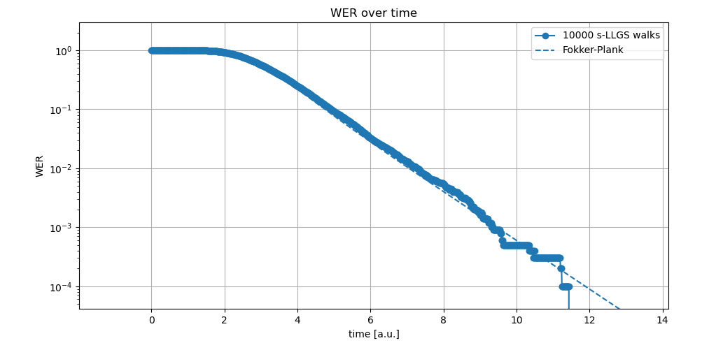
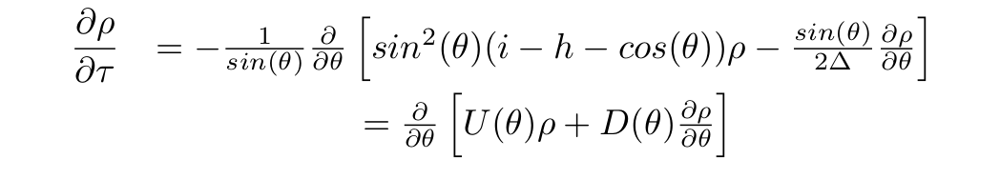
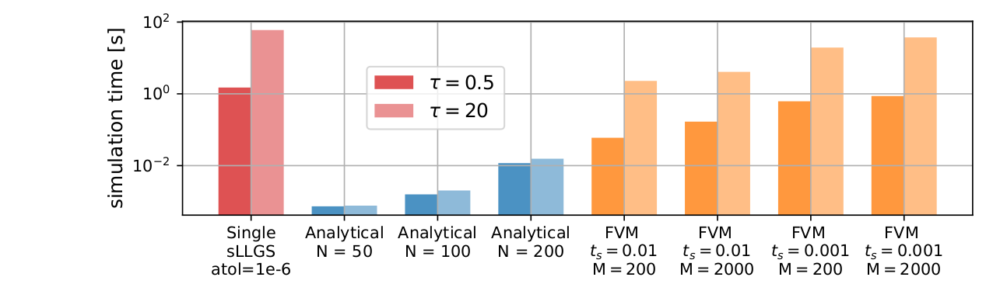
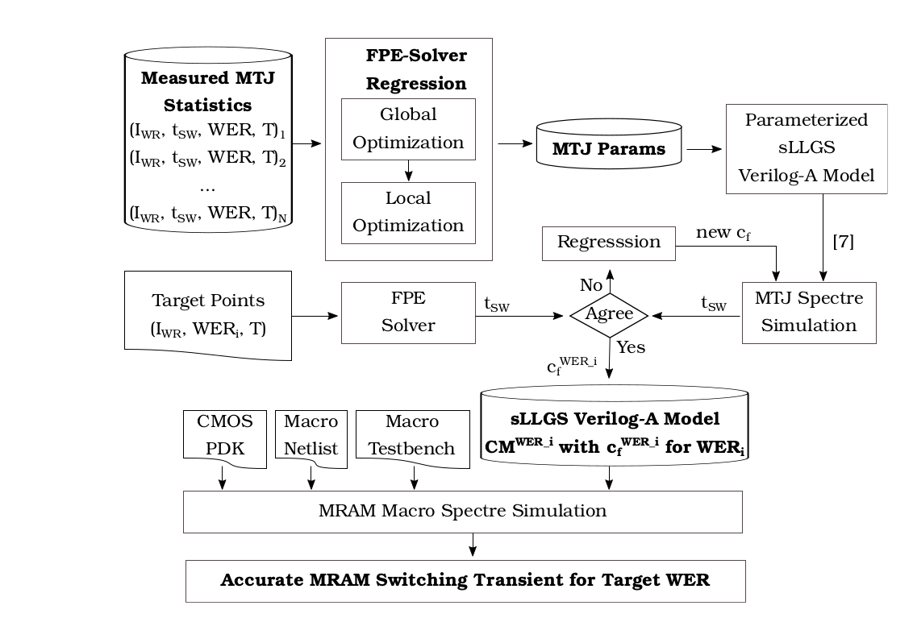
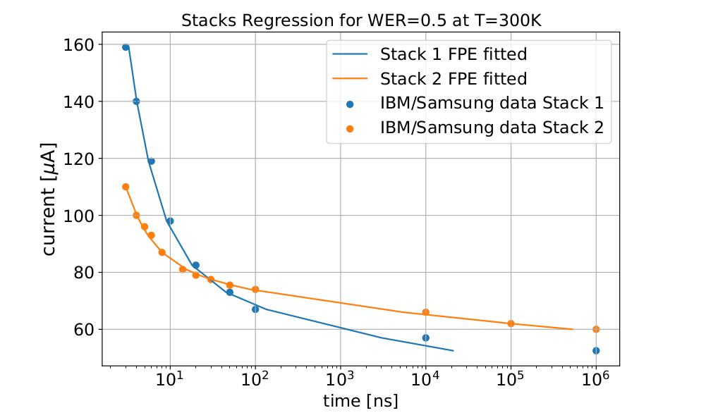
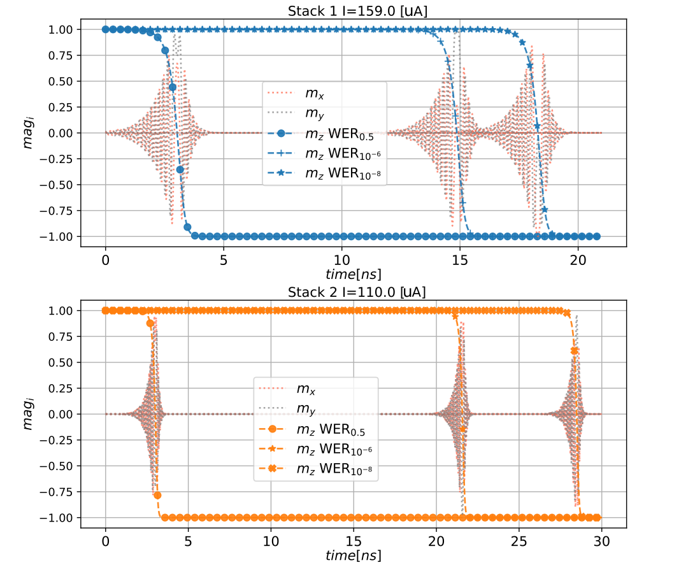

<!-- vim-markdown-toc GitLab -->

* [MRAM Stochasticity, but how do MRAM cells work?](#mram-stochasticity-but-how-do-mram-cells-work)
* ["A Fokker-Planck Solver to Model MTJ Stochasticity", or how to efficiently analyze stochasticity in MRAM.](#a-fokker-planck-solver-to-model-mtj-stochasticity-or-how-to-efficiently-analyze-stochasticity-in-mram)
		* [Fokker-Plank Equation](#fokker-plank-equation)
		* [Presented Solution Framework](#presented-solution-framework)
* [Arm's MRAM Simulation Framework, an overview.](#arms-mram-simulation-framework-an-overview)
* [References](#references)

<!-- vim-markdown-toc -->

* Fernando Garcia Redondo,
* Pranay Prabhat
* Mudit Bhargava

Thanks to Cyrille Dray and Milos Milosavljevic for his helpful discussions.

The following frameworks have been presented at
* ***A Compact Model for Scalable MTJ Simulation***, IEEE International Conference on Synthesis, Modeling, Analysis and Simulation Methods and Applications to Circuit Design, SMACD 2021.
* ***A Fokker-Planck Solver to Model MTJ Stochasticity*** European Solid-State Device Research Conference, ESSDERC 2021.

# MRAM Stochasticity, but how do MRAM cells work?

In the previous post, ***"A Compact Model for Scalable MTJ Simulation", or how to reliably and efficiently simulate circuits with MRAM, including stochasticity*** we introduce
MRAM technologies, and analyze compact model for the efficient simulation
of MRAM cells in large-scale circuits.

MRAM is a NVM technology intrinsically stochastic.
Translated to the circuit domain, the periphery surrounding the MRAM cell should be 
aware of this behavior, and designed accordingly to be able to reliably write/read
the MRAM cells incurring into low Write/Read Error Rates (WER and RER respectively).
**Therefore the circuit design relies then on the accurate modeling and simulation of 
the stochastic behavior of MRAM cells.**

**Figure 1. Stochasticity causes two different write operations in the same cell to behave differently**

Moreover, there we described how the simulation of
**stochastic differential equation (SDE) systems require
the use of Ito or Stratonovich calculus** *[P. Horley, S. Ament]*.
Standard methods are not applicable,
and the simulation of SDEs becomes a problem that involves myriad of simulations
using of small time step, requiring huge computational resources.

In the present blog post,
related to the work ***"A Fokker-Planck Solver to Model MTJ Stochasticity" ESSDERC 2021***, 
we present a framework for the characterization
and analysis of MRAM stochasticity.
To calibrate the models for such stochastic based events, 
we implemented and analyzed two FPE solvers (numerical FVM and analytical), and
presented an optimization module that orchestrates the efficient computation 
of MRAM statistics and parameter regression.

# "A Fokker-Planck Solver to Model MTJ Stochasticity", or how to efficiently analyze stochasticity in MRAM.

As seen in Figure 10, the computation of  
WER/RER with s-LLGS simulations requires a large number
of random walks, especially for the low error rates (<< 1ppm)
required for volume production.

For example, the simulation of 10000 random walks solving the SDE using Stratonovich
Heun algorithm in Cartesian coordinates system (0.1ps time step) 
for the write error rate computation seen in Figure 12 took ~1150 hours. 
The characterization of a given MRAM cell for *WER=1e-8* 
would require a non-manageable amount of time and computational resources.

**Figure 12. WER simulation. 10000 SDE simulations using Stratonovich Heun method,
solved for cartesian coordinates system and 0.1ps time step took ~1150 hours.
Taking advantage of the presented python framework and multi-thread capabilities,
this computation time was reduced to ~18h (64 threads).
The Fokker-Plank WER computation is solved in seconds, providing the analytical solution.**

To alleviate this issue, Stochastic Differential Equation
(SDE) tools such as the Fokker–Planck Equation (FPE) statis-
tically analyze the MTJ magnetization and provide a simplified
solution with sufficient accuracy to analyze such error rates
[Tzoufras], [Y. Xie], [W. H. Butler].
Compared against a set of s-LLGS random-walk
transient simulations, the FPE accurately evolves an initial
MTJ magnetization probability through time based on the cur-
rent and external fields. Instead of independent transients, the
FPE computes the probability distribution of the magnetization
at a given instant, thus capturing the statistical behavior of the
MTJ cell. Figure 12 highlights how FPE is able to solve in seconds
what otherwise requires huge computational resources (myriads of s-LLGS simulations).

The problem magnifies when fitting to measured silicon data. Silicon measurement needs
low error rates to be captured accurately from finite memory
arrays without compromising test throughput in volume production,
requiring high currents to allow extrapolation from
higher, more easily measurable error rates. 
As a result, foundry
data could consist of a set of data points with the error rate
spanning orders of magnitude. 

Addressing both problems, 
the proposed stochastic framework
for the characterization and analysis of MRAM stochastic effects is described,
and the fitting of the complex set of MRAM parameters onto
such heterogeneous data points through a case study with
published foundry data. 

With the proposed solution, we are able to generate WER/RER in seconds,
enabling the search of the set of physical parameters 
that best fit a collection of ER points as a
function of a current pulse width and amplitude.

### Fokker-Plank Equation
The advection-diffusion or Fokker-Plank equation has been widely used to analyze
the evolution over time of the 
probability density function of the magnetization of an MRAM cell:

**Figure 13. Fokker-Plank equation**

Prior work numerically solves the FPE through finite differences
or finite volume methods (FVM) or analytical solutions.

**Figure 14. Computational load comparison of a single s-LLGS random walk and different FPE solvers**
In the above Figure we characterize the computational load required to simulate
a single s-LLGS stochastic random walk, different FVM FPE simulations using
different time and spatial resolutions, and various analytical FPE simulations
varying the number of coefficients of the expansion series used.
First, it can be clearly seen how computing millions of s-LLGS is simply unmanageable.
Second, while FVM FPE approaches are a good method for small amount of WER/RER computations,
should multiple simulations be required, like it is the case on the design space exploration
occurring during MRAM parameters fitting, the faster yet accurate analytical
solutions approach is required.

It is important to highlight that even FVM FPE solutions constituted a reasonable
solution enabling statistical analyses otherwise impossible using billions of s-LLGS,
the simulation time is directly proportional at the writing pulse width being simulated.
Therefore longer simulated times, required to characterize low-current regimes,
still involve huge computational resources.
On the contrary, the analytical FPE approach otherwise requires constant time to simulate
longer pulse widths.

### Presented Solution Framework

Complementing the compact model and simulation framework that enable the
efficient simulation of circuits with MRAMs, the MRAM characterization 
framework focus on the MRAM behavior statistical analysis.

As described in the following Figure,
it enables the otherwise impossible MRAM parameter set regression from 
foundry WER curves.

**Figure 16. Proposed framework and methodology**

At the end of the process, the circuit designer obtains a set of MRAM compact models,
ready to be simulated in traditional circuit simulators, that have been 
accurately calibrated to represent the mean/*WER_i* cell behavior.

As a case of study, we take the two stack processes presented in [G. Hu], 
where a set of current/mean switching time points are provided.
First the most computing intensive tasks, regressing the MRAM parameters set
that best describe the provided stochastic behaviors takes place.
Our framework finds the proper parameters in reasonable time (*< 3 days*),
a task otherwise completely impossible using s-LLGS simulations,
and much slower (almost impractical) using FVM approaches.

**Figure 17. Current/switching time fitting for two MRAM stack processes without any prior knowledge**

With the physical parameters set found, we make use of the compact model presented at
["A Compact Model for Scalable MTJ Simulation"](#a-compact-model-for-scalable-mtj-simulation-or-how-to-reliably-and-efficiently-simulate-circuits-with-mram-including-stochasticity)
section, and compute the *H_fth_i* parameters that enable circuit designers 
to accurately simulate the required MRAM cell at the significant *WER_i* statistical events: 

# Arm's MRAM Simulation Framework, an overview.

In this series of posts, we presented a framework for the characterization
and analysis of MRAM stochasticity, and a compact model and framework
for the efficient and scalable simulation of circuits with MRAMs.

We provided Verilog-A and Python compact models, able to emulate the behavior of
MRAMs switching at significant statistic events.
To calibrate the models for such stochastic based events, 
we implemented and analyzed two FPE solvers (numerical FVM and analytical), and
presented an optimization module that orchestrates the efficient computation 
of MRAM statistics and parameter regression.

# References

[P. Horley] Horley, P., et al. (2011).
Numerical Simulations of Nano-Scale Magnetization Dynamics.
Numerical Simulations of Physical and Engineering Processes. https://doi.org/10.5772/23745

[S. Ament] S. Ament et al., “Solving the stochastic Landau-Lifshitz-Gilbert-
Slonczewski equation for monodomain nanomagnets : A survey and
analysis of numerical techniques,” 2016.

[OOMMF] Donahue, M. J., & Porter, D. G. (1999).
OOMMF user’s guide, version 1.0. In National Institute of Standards and Technology. https://doi.org/10.6028/NIST.IR.6376

[E. M. Boujamaa] E. M. Boujamaa et al., “A 14.7Mb/mm2 28nm FDSOI STT-MRAM with
Current Starved Read Path, 52Ω/Sigma Offset Voltage Sense Amplifier
and Fully Trimmable CTAT Reference,” IEEE Symp. VLSI Circuits, Dig.
Tech. Pap., vol. 2020-June, 2020.

[Tzoufras] Tzoufras, M. (2018). Switching probability of all-perpendicular spin valve nanopillars. AIP Advances, 8(5). https://doi.org/10.1063/1.5003832

[Y.Xie] Xie, Y., et al. (2017). Fokker-Planck Study of Parameter Dependence on Write Error Slope in Spin-Torque Switching. IEEE Transactions on Electron Devices, 64(1), 319–324. https://doi.org/10.1109/TED.2016.2632438

[W. H. Butler] Butler, W. H., Mewes, T., Mewes, C. K. A., Visscher, P. B., Rippard, W. H., Russek, S. E., & Heindl, R. (2012). Switching distributions for perpendicular spin-torque devices within the macrospin approximation. IEEE Transactions on Magnetics, 48(12), 4684–4700. https://doi.org/10.1109/TMAG.2012.2209122

[G. Hu] Hu G. et al., “Spin-transfer torque MRAM with reliable 2 ns writing for
last level cache applications,” Tech. Dig. - Int. Electron Devices Meet.
IEDM, vol. 2019-Decem, pp. 2019–2022, 2019.
